# Webhook Delivery System

## Architecture Overview

This system consists of three main services:
- **Webhook Receiver Service**: Receives webhooks, validates HMAC, stores in MongoDB, and triggers background delivery via Celery.
- **Downstream Mock Service**: Simulates a downstream API with rate limiting (3 requests/second) and random failures (10-20%).
- **MongoDB**: Stores webhook events and delivery attempts.
- **Redis**: Used as Celery broker and for distributed rate limiting.
- **Celery Worker**: Handles background delivery tasks with exponential backoff.



## Delivery Workflow

1. Webhook received at `POST /webhooks/ingest`
2. HMAC signature validated using secret key from `.env`
3. Event stored in MongoDB with:
   - `status = RECEIVED`
   - `received_at` timestamp
   - Event type (if included in payload)
   - Full raw event payload
4. Celery task triggered for background delivery
5. Worker atomically claims event by updating status to `DELIVERING`
6. Delivery attempted to `POST /downstream/receive`
7. Each attempt logged with:
   - Timestamp
   - Attempt number
   - HTTP status code
   - Success/failure flag
8. Exponential backoff on failure: 1s → 2s → 4s → 8s → 16s (max 5 attempts)
9. Final status: `DELIVERED` or `FAILED_PERMANENTLY`



## Multi-Replica Safety

### Strategy: Atomic Event Claiming
The system uses atomic database updates to ensure safe operation across multiple replicas:

- **Atomic Status Updates**: Before processing, workers atomically update event status from `RECEIVED` to `DELIVERING` using MongoDB's `findAndModify` operation
- **Claim-Based Processing**: Only the worker that successfully updates the status processes the event
- **Redis Task Queue**: Celery with Redis broker ensures each task is consumed by exactly one worker
- **Prevents Race Conditions**: Multiple replicas cannot process the same event simultaneously

This guarantees:
- Only one worker processes each event
- No duplicate deliveries
- Safe concurrent operation

## Setup Instructions

1. Clone the repository
2. Ensure Docker and Docker Compose are installed
3. Create `.env` file with required configuration (HMAC secret key)
4. Run `docker compose up --build`
5. Services will be available at:
   - Webhook Service: http://localhost:8000
   - Downstream Service: http://localhost:8001
   - MongoDB: localhost:27017
6. For multi replica `docker compose up --build --scale webhook-service=2 --scale downstream-service=2 --scale celery-worker=2`

## Testing

### Webhook Service Tests
```bash
docker exec -it wds-webhook-service-1 bash
PYTHONPATH=. pytest tests/
```

### Downstream Service Tests
```bash
docker exec -it wds-downstream-service-1 bash
PYTHONPATH=. pytest tests/
```

## Search & Aggregation API

**Endpoint**: `POST /webhooks/search`

**Features**:
- **Filtering**: By status, timestamp range (`from`, `to`), event type
- **Aggregations**: 
  - Count by status (`RECEIVED`, `DELIVERED`, `FAILED_PERMANENTLY`)
  - Count by event type
  - Hourly histogram of events
- **Pagination**: Supports skip/limit

## Metrics

Prometheus-style metrics available at `http://localhost:8000/metrics`:
- Total events received
- Successful deliveries
- Failed deliveries
- Total retry attempts

## API Documentation

Interactive OpenAPI documentation available at:
- `http://localhost:8000/docs`
- `http://localhost:8001/docs`

I have also attached a Postman collection to ensure reliable testing of all requests. (Available in docs folder)

## Bonus Features Implemented

- **Idempotency Keys**: Include `idempotency_key` in payload to prevent duplicate event processing
- **Batch Ingestion**: Support for ingesting multiple events in a single request
- **Asynchronous Background Workers**: Celery for reliable, distributed task processing
- **Distributed Rate Limiting**: Redis-based rate limiter (3 req/sec) with atomic operations, multi-replica safe